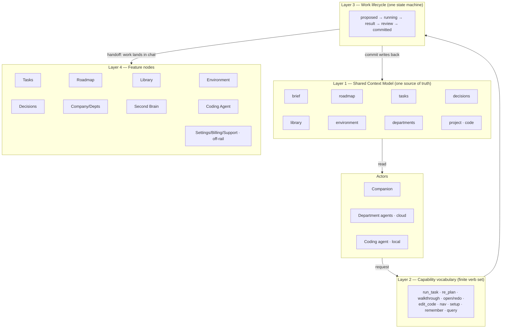
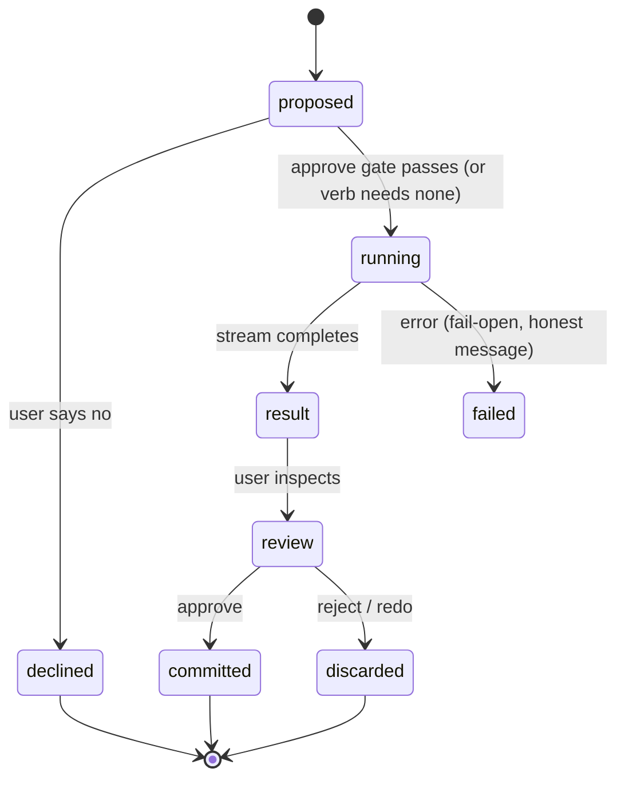
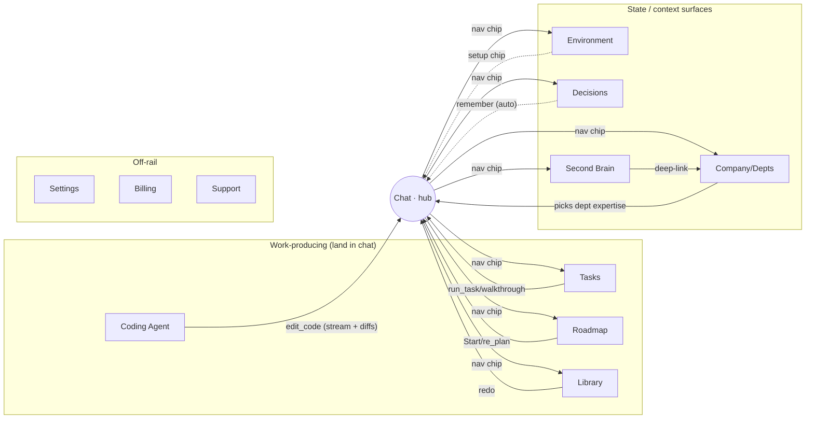

# Chat ⇄ Everything — System Integration Map (Design)

_Date: 2026-07-29 · Repo: My-Outcasts/codepet (native macOS SwiftUI) · Part 1 of 2_
_Companion doc (Part 2): the Coding Agent feature spec — see "Bridge to Part 2" below._

## Context

Codepet's chat is already the product's primary surface. The chat-first shell
(`2026-07-27-chat-first-shell-design.md`) made chat the landing destination:
run-task output streams into it, approvals happen in it, and `nav` chips route
out of it to the other pages (Roadmap, Second Brain, Company/Departments, Tasks,
Library, Environment).

So this is **not** a "wire chat to features from scratch" design. Chat is the hub.
The problem is that the **contract between chat and everything else is uneven,
partial, and — for one feature — missing entirely**. Concretely, from reading the
current code:

- **The read-surface is one opaque string.** `CompanyChatRequest` carries a flat
  `context: String` assembled client-side, plus two lists (`runnable`, `envSetup`).
  Chat has no structured view of roadmap, decisions, library, or the user's code.
- **The action vocabulary is four verbs.** A companion reply
  (`CompanyChatResponse` / `ChatDoneAction`) can carry exactly: `run_task_id`,
  `nav`, `setup`, `remember`. That covers 4 of ~10 features.
- **There is no `edit_code` verb.** `ClaudeCodeRunner` — which already drives the
  user's own `claude` CLI headless against a project dir, streams tool-use events,
  and computes real before/after file diffs — is wired **only** into the
  Skills/Exercise learning flow. The chat contract cannot see it.
- **Results land in three different places.** run-task streams into chat; a
  finished task opens a deliverable sheet; roadmap "Start" navigates to chat;
  "Re-plan for my stage" is a button buried in the Departments index.

The founder named four gaps this map must fix (all four, whole product surface):
(1) chat can't read/act on all features; (2) feature→chat handoffs are
inconsistent; (3) there's no unified "an agent is doing work" model across the
cloud department-agents and the local coding agent; (4) state/context isn't
shared across surfaces.

## Goal

Define **one coherent contract** — the "Capability Bus" — that every surface reads
from and writes through, so that: chat can read and act on any feature; every
work-producing action lands in one predictable place; the cloud deliverable agents
and the local coding agent are the *same lifecycle* with two backends; and there is
a single source of truth for context.

This document is a **map and a contract**, not an implementation plan. It defines
the four layers, the finite verb set, the one lifecycle, the one handoff rule, and
a per-feature node table. All coding-agent internals (sandbox, branch strategy,
honest-plan fallback, diff-approval UI) are deliberately deferred to Part 2.

## Non-goals

- No Cloud Function, `RoadmapEngine`, Firestore schema, or onboarding changes are
  specified here. This is the target contract, not the migration.
- No coding-agent internals (Part 2 owns those).
- No new pricing. The credits model (`codepet-pricing-spec`) is a given; this doc
  only requires that the credits-vs-own-subscription distinction stays *visible*.
- Not a redesign of the chat-first shell — it extends that shell's contract.

## The model in one picture



The bus has one direction of truth: **actors read the Context Model, request a
Capability, that runs through the one Lifecycle, results hand off to chat, and only
a committed result writes back into the Context Model.** Nothing else mutates
context. That single write-path is what makes the four surfaces consistent.

---

## Layer 1 — Shared Context Model (fixes gap #4)

Replace the opaque `context: String` with **one structured context object** that
every surface reads and that only the lifecycle's `commit` step writes. Each feature
contributes a *slice*; no feature reads another's private state directly — they read
the shared model.

| Slice | Source of truth (today) | Carries |
|---|---|---|
| `brief` | onboarding output | who / what / stage / `founderName` |
| `roadmap` | `RoadmapEngine` | phases, ordered tasks, `nextStep` beacon |
| `tasks` | roadmap tasks | per-task status: `codepetCanDo` / `needsYou` / `needsApproval` / `done` |
| `decisions` | `company.decisions` | durable facts (what `remember` writes) |
| `library` | deliverables store | produced artifacts + live/static status |
| `environment` | `Toolkit` catalog + `enabledTools` | which tools on/off + "used in N tasks" receipts |
| `departments` | `DepartmentCatalog` | the 8 departments + per-dept expertise |
| `project` **(new)** | **new** | linked repo path, `CLAUDE.md` contents, recent code changes, branch state |

**Why the `project` slice is the linchpin.** Chat "can't read all features" today
largely because this slice does not exist — the user's actual code is invisible to
the contract. Adding it is what lets `edit_code` be a first-class verb rather than a
bolt-on. It also unifies the existing `project references` feature (reading cards →
CLAUDE.md, per `codepet-project-references-feature`) with the coding agent: both
read and write the same `project` slice.

**Read shape, not a dump.** The context object is assembled from these slices per
request (as `context` is today) but *typed and per-slice*, so the server and any
agent can select only what a given verb needs — e.g. `edit_code` needs `project` +
`decisions`; `re_plan` needs `brief` + `roadmap`. This keeps token cost controlled
(consistent with `codepet-pricing-spec` prompt-caching) and keeps the "sharp, few
words" North Star: agents get exactly the slice they need.

---

## Layer 2 — Capability vocabulary (fixes gap #1)

The complete finite set of verbs any actor (companion, department agent, coding
agent) may request. This extends today's four real verbs; it does not replace them.
Each verb names a target feature node and declares its approval posture.

| Verb | Targets | Approval | Status today |
|---|---|---|---|
| `run_task` | Tasks → Library | approve on result | ✅ exists (`run_task_id`) |
| `nav` | any page | n/a — chip, never auto-navigates | ✅ exists |
| `setup` | Environment | one-tap enable | ✅ exists |
| `remember` | Decisions | none — auto-merge into `company.decisions` | ✅ exists |
| `re_plan` | Roadmap | approve the new plan | ⚠️ exists as a manual Departments button, not a chat verb |
| `walkthrough` | Tasks (`needsYou`) | n/a — guided one-at-a-time | ⚠️ exists as `walkThroughTask`, not part of the reply contract |
| `open` / `redo` | Library | none / approve on redo | ⚠️ ad-hoc per card |
| **`edit_code`** | **Coding Agent** | **diff review + branch/PR, never auto-merge** | ❌ **missing from the contract entirely** |
| `query` (read-only) | any slice | none | ❌ implicit inside `context` today; make it explicit |

**Rules that keep the vocabulary honest:**

- **Mutually-exclusive work verbs.** As today (`run_task`/`nav`/`setup` are ≤1
  non-nil per reply), a single reply proposes at most one *work* verb. `remember`
  and `query` are orthogonal and may co-occur.
- **`nav` never auto-navigates.** It is always a tappable suggestion. This is the
  existing deliberate rule and it stays — it is the boundary between "chat suggests"
  and "user decides."
- **`edit_code` is the only verb that touches the user's real code**, and it is the
  only verb whose approval is a *diff*, not text. That difference is deliberately
  surfaced (see Layer 3 and the honest-tension note).

---

## Layer 3 — Work lifecycle (fixes gap #3)

One state machine that both execution backends flow through:



**Two backends, same shape:**

- **Cloud path** (`run_task`, `re_plan`, `open/redo`) — runs department agents on
  the **CompanyChat/RunTask Cloud Functions**, billed to **Codepet credits**.
  `proposed → running` streams over SSE (the existing `CompanyChatStreamEvent`
  delta/done frames); `result` is a deliverable card; `commit` marks the task
  `done` and advances the roadmap (the dup-fix in the chat-redesign handoff already
  wired chat-run to advance the roadmap exactly like the board path).
- **Local path** (`edit_code`) — runs the **user's own `claude` CLI** via
  `ClaudeCodeRunner`, on the **user's own Claude subscription** (no Codepet credits).
  `proposed` shows an **honest-plan preview**; `running` streams `ClaudeCodeRunner`'s
  tool-use events (Edit/Write/Bash/Read) into the exec log; `result` is the **real
  file diffs** it computes; `commit` writes to a **separate branch + PR, never an
  auto-merge**. Internals are Part 2.

**The map's claim:** these are the *same* lifecycle with two execution backends.
The UI for "an agent is working," the streamed exec log, and the approve/reject
gesture are shared. They differ honestly in two places only — **billing** (credits
vs. the user's own subscription) and **trust surface** (approve text vs. approve a
diff). See the honest-tension note.

**Honest fallback (both paths).** Fail-open is the house style
(`CompanyChatClient` returns nil → honest offline message; `ClaudeCodeRunner`
surfaces friendly "not installed / not logged in" errors). The lifecycle's `failed`
state formalizes this: when the coding agent can't execute a real change, it falls
back to an **honest code-change plan** (the PRD's stated fallback: "Engineering
executes & verifies real code changes; an honest code-change plan is the fallback")
rather than pretending. This mirrors the deliverable side, where `plan` is the
honest reframe of `pr` (`codepet-deliverable-live-status`).

---

## Layer 4 — Handoff contract (fixes gap #2)

**One rule: work always surfaces as a card in the chat transcript. Pages are for
browsing and managing state; chat is where work happens and results land.**

- **chat → feature.** `nav` is a suggestion chip; the user taps it to browse a page.
  Chat never yanks the user to a page on its own.
- **feature → chat.** Any action that *produces work* navigates to chat and streams
  there. This generalizes the mitigation the chat-first shell already adopted for
  roadmap "Start" (`.codepetCanDo`/`.needsYou` navigate to `.chat`; `.needsApproval`
  and `.done` do not). We make it a rule for every node:

| Action kind | Where it lands | Examples |
|---|---|---|
| Produces work | **Chat** (streams, then result card) | run a task, re-plan, walkthrough, `edit_code`, redo a deliverable |
| Pure state view | **In place** (page/sheet) | open a finished deliverable, view billing, read Second Brain |
| Suggestion | **Chat chip** (user taps) | `nav`, `setup` |

This is the single predictable model the founder asked for: if an agent is going to
*do something*, you watch it happen in chat; if you're just *looking at* something,
it opens where it lives.

---

## The per-feature node map (core deliverable)

For each feature node: the context slice it **feeds**, the capabilities it
**exposes**, and how it **hands off** to/from chat.

| Node | Feeds context | Exposes capabilities | Handoff |
|---|---|---|---|
| **Chat** | (assembles the read model per turn) | requests every verb | is the hub; receives all work |
| **Tasks** | `tasks` status | `run_task`, `walkthrough` | work → chat; board is a state view |
| **Roadmap** | `roadmap`, `nextStep` beacon | `re_plan`; Start dispatches `run_task`/`walkthrough` | Start → chat; map is a state view |
| **Library** | `library` (artifacts + live/static) | `open`, `redo` | redo → chat; open → in-place sheet |
| **Environment** | `environment` (on/off + receipts) | `setup` | enable chip in chat; page manages toolkit |
| **Decisions** | `decisions` | `remember` (write), `query` (read) | `remember` auto-merges; "Noted" chip in chat |
| **Company / Departments** | `departments` (expertise) | selects which agent/expertise a verb uses (the composer's department pill) | dept detail is a state view; the manual "Re-plan" button becomes the `re_plan` verb |
| **Second Brain** | reads `roadmap`+`departments` for its panel | `query`; department rows deep-link (`nav` to a dept) | pure state view; rows open Company |
| **Coding Agent** *(Part 2)* | `project` (repo, CLAUDE.md, diffs, branch) | **`edit_code`**; honest-plan fallback | work → chat (exec log + diffs); commit → branch/PR |
| **Settings / Billing / Support** *(off-rail)* | — | — (account surfaces) | pure state views, reached from account menu |

**Whole-bus graph:**



---

## The honest tension (kept visible, by design)

Unifying the two backends under one lifecycle is right for UX, but the difference
must stay **visible to the user**, never hidden:

- **Cloud department-agents** (deliverables) cost **Codepet credits**
  (`codepet-pricing-spec`: chat ~0.25 credit/msg, run-task per the plan).
- **The coding agent** runs on the **user's own Claude subscription** via their own
  `claude` CLI — Codepet adds no API key and no extra billing (the explicit design
  note in `ClaudeCodeRunner.swift`).

The map therefore requires that a work card show **which backend ran it** and
**what it cost** (credits, or "ran on your Claude subscription"). Same lifecycle,
honest labels. This also protects the North Star "leverage made visible" metric: the
user can always see what the work cost and where.

The **trust surface** differs the same way and is surfaced the same way: cloud
results are approved as *text/deliverables*; `edit_code` results are approved as a
*diff*, and only commit to a *branch/PR* — never the working tree unattended,
never a merge. This is the §5.5 safety ceiling made concrete at the contract level.

---

## Bridge to Part 2 — the Coding Agent

Part 1 places the coding agent as a node and defines its seam: the **`edit_code`
verb**, the **`project` context slice**, and its passage through the **one work
lifecycle** with a diff-based review and branch/PR commit. Everything below is
explicitly deferred to the Part 2 spec:

- How a project gets linked (folder picker, repo detection, CLAUDE.md bootstrap).
- Sandbox / working-tree strategy and the branch + PR mechanics.
- The honest-plan fallback's exact shape when the CLI is missing/unauthenticated.
- The diff-approval UI (accept-all / per-file / per-hunk) and how it renders in chat.
- Reuse vs. extension of `ClaudeCodeRunner` (today scoped to the Exercise flow) and
  its relationship to the cloud department agents.
- Autonomy tiers (§5.5 Companion mode): Level 1 observe/prepare, Level 2
  fix-into-a-branch — foundation only in v1.

## Success criteria for this map

The map is "done" when it can answer, for **any** feature, three questions with a
single consistent answer:

1. **Read** — what context slice does chat/an agent get from it?
2. **Act** — what verb(s) does it expose, and what's the approval posture?
3. **Land** — where does the result of acting show up?

If a new feature is added later, it is correctly integrated iff it can fill one row
of the node table: feeds a slice, exposes verbs, and obeys the one handoff rule.

## Open questions to resolve before Part 2 / implementation

1. **Context object transport.** The typed per-slice context still crosses the wire
   to the CompanyChat CF as some serialized form. Is it a structured JSON object
   replacing today's `context` string, or a set of typed fields alongside it?
   (Affects the CF contract; decide in implementation planning, not here.)
2. **`re_plan` and `walkthrough` as reply verbs.** Both exist as app-side actions
   today. Promoting them into the companion's reply contract means the CF must be
   able to emit them — a CF change. In scope for the contract; sequencing is a plan
   question.
3. **Where the `project` slice lives. — RESOLVED (2026-07-29): client-only.** The
   `project` slice (repo path, CLAUDE.md, working-tree diffs, branch state) stays on
   the user's machine and is read **only by the local coding agent**. The user's
   real code never travels to the cloud — not even a redacted summary. Implication:
   the cloud companion is *not* code-aware; it can propose `edit_code` (and reason
   from the `brief`/`decisions`/`library` slices), but only the local agent reads
   and writes the actual source. This is a privacy/trust default, and it draws a
   hard line for Part 2: everything code-touching is local.
4. **One transcript or per-backend?** Cloud and local work share the chat transcript
   in this map. Confirm that's desired even when a long `edit_code` run streams
   dozens of tool-use lines (vs. collapsing into a single expandable exec-log card —
   the `ChatExecLog` pattern already exists).
```
